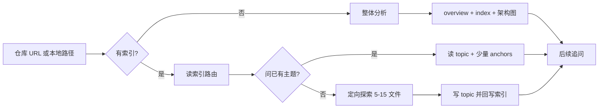

# opensource-aiproject-explorer

**开源项目架构与特性设计分析 Skill：读懂业务逻辑，再判断哪些值得借鉴。**

## 整体介绍

`opensource-aiproject-explorer` 是一份供 Agent 调用的分析 Skill。

当你面对一个开源仓库——尤其是 AI、Agent、LLM 应用或相关基础设施——它帮助你系统回答两类问题：

1. **整体架构**：这个项目解决什么问题？一次请求怎样穿过模型、Agent、工具和状态层？模块之间如何协作？
2. **特性详细设计**：Memory、Planning、RAG、Tool Use、Sandbox、Skills 等关键能力为何存在、怎样运转、输入输出是什么、失败如何处理？

产出的文档同时面向人和后续对话中的 Agent：

- **理解设计的业务逻辑**：沿真实场景看清谁触发、谁负责、谁消费、何时结束、失败归谁；
- **落到可核对的实现**：关键业务动作对应到函数、配置、事件、状态字段或最小代码片段；
- **判断可借鉴之处**：区分“跨项目可迁移的原则”与“仅属于当前仓库的特殊选择”，便于吸收进自己的系统，而不是照搬目录结构。

分析路径强制走通：**真实场景 → 概念本质 → 请求生命周期 → 源码锚点 → 可迁移原则**，并把结果持久化为 overview、主题文档与索引，支持增量追问，避免每次重新全仓扫描。

> 禁止两种极端：不能只写业务故事没有源码落点；也不能堆砌函数名让人看不懂业务流程。

---

## 为什么需要它

读开源 Agent / LLM 项目时，常见失败模式：

| 痛点 | 常见结果 |
|------|----------|
| 只有业务故事 | 知道“大概有 Memory / RAG”，却找不到函数、状态字段、事件从哪来 |
| 只有文件与符号堆砌 | 知道一堆类名，却讲不清谁触发、谁消费、失败归谁、何时结束 |
| 每次追问都全仓重扫 | 成本高、结论漂移、无法在旧分析上继续深挖 |
| 概念与实现混在一起 | 初学者一上来就被 Prompt、配置项和内部术语淹没 |
| 读完仍难借鉴 | 清楚“别人怎么写的”，不清楚“自己该带走什么、不该照搬什么” |

本 Skill 同时服务两类读者：

- **先理解业务的人**：沿真实场景理解项目的设计思路
- **准备读源码或做选型的人**：在每个关键动作后找到落点，并判断可迁移边界

---

## 核心优势

### 1. 双层叙事：业务逻辑 × 源码落点

每个关键阶段都按固定节奏展开：

```text
真实场景 → 业务动作 → 输入/输出 → 关键实现名 → 小示例 → 边界与代价 → 证据锚点
```

读者先把握设计思路，再进入代码；函数名服务于解释，而不是喧宾夺主。

### 2. 持久化索引，追问不再重扫全仓

首次分析会生成机器可读索引 `01-index.json`，后续问题走增量协议：

- **索引优先**：先路由到 overview / topic / FAQ
- **锚点优先**：实现问题通常只读 2–6 个关键文件
- **定向扩展**：新主题通常探索 5–15 个相关文件
- **局部刷新**：源码变更时只更新受影响主题，而不是推倒重来

分析成本可控，知识可累积，长对话也不会反复“从头认识这个仓库”。

### 3. 先理清设计思路，再按需深潜

| 模式 | 产出 | 适用 |
|------|------|------|
| **整体分析** | `00-overview.md` + `01-index.json` + 架构图 | 第一次接触项目 |
| **特性深潜** | `topics/<feature>.md`（必要时 Prompt 档案） | 追问 Memory / RAG / Tool Use 等 |

不会一上来把所有子系统挖穿；先标出候选特性，再按你的问题增量展开。

### 4. 特性深潜四段式，可迁移而不照搬

每个主题固定覆盖：

1. **概念本质**：为何诞生、一句话 `输入 → 变换 → 输出`、上下游
2. **项目实现**：业务解释 → 实现映射 → 短示例 → 边界
3. **迁移应用**：哪些原则可带走，哪些只是当前项目的特殊选择
4. **复习**：三句话复述 + 常见误解 + 下一步问题 + 证据

适合把开源设计吸收进自己的系统，而不是只会复述别人仓库结构。

### 5. Token 预算写进协议，而不是靠运气

整体扫描优先读 README、官方架构文档、主入口和核心类型；跳过 vendor / dist / 大规模 fixtures。证据足够即停止——用工程约束保证分析既充分又克制。

### 6. 模板 + 质量门，输出稳定可复用

内置 overview / topic / prompt / index 模板，以及写作规范与检查清单：

- 有真实业务场景贯穿，不只是模块介绍
- 每个关键环节有输入输出与短示例（JSON / 消息 / 状态 / 参数）
- 通用概念、项目术语、教学类比、推断彼此区分
- 结论挂源码 anchors；链接、Mermaid、章节锚点可验证

同一套 Skill 分析不同仓库时，文档结构一致，便于对比与沉淀。

### 7. 专为 AI / Agent 项目优化

覆盖常见关键设计的导读与深潜路径，例如：

- Memory / Planning / RAG
- Tool Use / Sandbox / Skills
- 请求生命周期、状态层、Prompt 行为控制点

当 Prompt 真正控制系统行为时，可单独建 Prompt 档案：调用位置、结构区块、变量、解析器与下游消费者一目了然。

---

## 快速开始

### 1. 获取本 Skill

本 Skill 位于仓库中的同名目录：

```text
ArchExplorer/
└── opensource-aiproject-explorer/
    ├── SKILL.md              # 入口：目标、协议、质量门
    ├── README.md             # 本说明
    ├── references/
    ├── templates/
    └── examples/
```

将 `opensource-aiproject-explorer/` 放到 Agent 可加载的 Skill 目录，或在对话中显式引用该目录下的 `SKILL.md`。

### 2. 发起分析

提供 Git 仓库链接或本地源码路径，例如：

```text
请按 opensource-aiproject-explorer 协议分析这个项目：
https://github.com/<org>/<repo>
```

或：

```text
分析本地路径 D:\code\<repo> 的整体架构，输出到 projects/<name>/
```

首次会生成整体导读；之后可继续追问：

```text
深潜一下它的 Memory 设计
Tool Use 的调用链是怎样的？失败如何回传？
哪些机制适合迁移到我们自己的系统？哪些不要照搬？
```

### 3. 典型产物结构

```text
projects/<project>/
├── 00-overview.md          # 面向初学者的整体导读
├── 01-index.json           # 增量路由与源码锚点索引
├── diagrams/
│   └── architecture.mmd    # 架构图源
├── topics/
│   └── <feature>.md        # 按需深潜
└── prompts/                # 仅当 Prompt 行为关键时
    └── <feature>-*.md
```

---

## 它如何工作



强制执行顺序（摘要）：

1. 确认源码位置、输出目录与任务模式  
2. 检查 `01-index.json`  
3. 有索引则先读索引 / overview / topic  
4. 文档不足时才进入源码；从 anchors 开始，证据够了就停  
5. 回写索引、版本与 FAQ 路由  
6. 校验链接、JSON、Mermaid 与源码证据  

完整工作流见 [`references/workflow.md`](references/workflow.md)。

---

## Skill 目录结构

```text
opensource-aiproject-explorer/
├── SKILL.md                 # Skill 入口：目标、协议、质量门
├── README.md                # 本说明
├── references/
│   ├── workflow.md          # 获取源码、首次分析、深潜与刷新
│   ├── indexing.md          # 索引 Schema 与 Token 预算
│   └── writing-guide.md     # 初学者叙事与环节说明卡
├── templates/
│   ├── overview.md
│   ├── topic.md
│   ├── prompt.md
│   └── index.json
└── examples/
    └── codex-memory.md      # 特性深潜示例（Codex Memory）
```

---

## 适合谁

- 想系统读懂开源项目整体架构与关键特性设计，而不是只收藏 Star
- 需要同时拿到「业务逻辑说明」和「源码落点」的学习者与团队
- 希望对同一仓库的分析可累积、可刷新的工程师
- 做技术方案选型时，要分清**可借鉴原则**与**不可照搬实现**的架构师 / 产品技术负责人

---

## 设计原则（一句话）

> **场景先于术语，概念先于实现，流程先于文件，业务动作先于函数名；示例连接抽象与源码；权衡先于结论；证据集中可回查。**

---

## 与“随便让 AI 总结仓库”的区别

| | 普通仓库总结 | 本 Skill |
|--|-------------|----------|
| 叙事 | 模块 / 文件清单为主 | 真实场景与请求生命周期为主 |
| 深度 | 一次尽量讲完 | 总览 + 按需深潜 |
| 成本 | 易重复全仓扫描 | 索引 + 锚点增量读取 |
| 落点 | 常缺精确符号 | 业务动作绑定函数 / 事件 / 状态 |
| 迁移 | 少谈边界 | 明确可带走 vs 勿照搬 |
| 质量 | 依赖当次发挥 | 模板 + 质量门约束 |

---

## License

[MIT](../LICENSE) © ArchExplorer contributors
