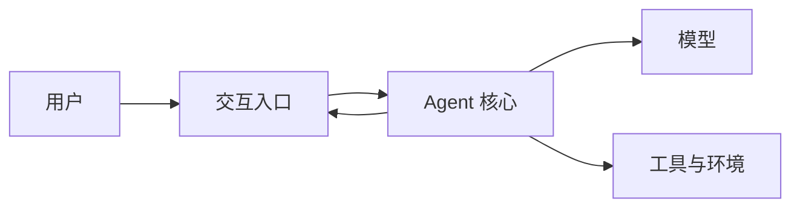

# <项目名称> 入门导读

> 分析日期：YYYY-MM-DD  
> 源码路径：`<source_path>`  
> 源码版本：`<revision-or-unknown>`

## 读完你会知道什么

- 这个项目解决什么问题？
- 一次请求怎样穿过系统？
- 哪些设计值得继续深入？

## 先用一句话认识它

<!-- 结论 + 具体使用场景 -->

## 从一次真实使用开始

<!-- 用户动作 → 系统处理 → 用户看到的结果，暂不讲源码 -->

## 梳理整体设计思路

<!-- 带读者走一遍主路径和边界 -->

## 理解核心概念

### <概念一>

<!-- 通俗解释 → 项目正式定义 → 与相邻概念区别 -->

## 一次请求怎样完成

<!-- 5–8 个步骤或时序图 -->

## 代码怎样组织

### 第一站：用户入口

### 第二站：核心引擎

### 第三站：执行、状态和扩展

## 值得继续学习的特性

### <特性>

<!-- 解决的问题、独特之处、可继续追问的问题 -->

## 如何运行与验证

## 建议的源码阅读顺序

1. `<file>`：建立整体术语。
2. `<file>`：理解主流程。
3. `<file>`：进入关键实现。

## 容易混淆的地方

## 下一步学什么

## 证据与版本说明
