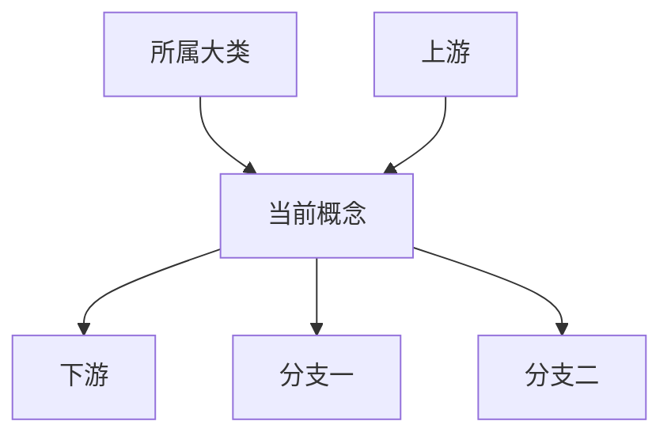

# <概念名称>：从本质到实现

> 所属项目：<project>  
> 创建日期：YYYY-MM-DD  
> 用户问题：<question>

## 阅读方式

- 第一次接触：读概念篇；
- 理解项目：读实现篇；
- 设计自己的系统：读迁移篇。

## 第一部分：概念本质

### 先用一个真实场景理解

<!-- 用一个贯穿全文的业务场景说明：用户想做什么，旧方案怎样处理，为什么会遇到边界。不要从函数、模块或目录开始。 -->

### 它为何诞生

#### 没有它之前

#### 旧方案遇到什么边界

#### 它带来什么改变

### 一句话核心逻辑

> **<输入> 经过 <核心变换>，成为 <下游输出>。**

### 上下游与分类



### 常见分类

#### <类型>

**解决的问题：**

**例子：**

**边界：**

### 完整例子

<!-- 用业务语言完整走一遍：谁触发、谁负责、谁消费、什么时候结束、失败归谁。 -->

### 概念篇避坑指南

## 第二部分：项目实现

### 通用概念如何映射到项目

<!-- 
按“业务概念 → 项目术语 → 关键实现名”解释。
例如：
- 业务角色：<主流程负责人> → 项目实体：<Session/Task/...> → 实现名：`FooState`
- 业务动作：<派工/检索/审批/压缩> → 工具或函数：`bar()` → 关键输入：`x`
- 业务产物：<通知/摘要/证据> → 事件或字段：`BazEvent`
-->

### 关键工具、函数或模块分别做什么

<!-- 
如果该特性暴露多个工具、动作、函数或模块，先澄清它们是“角色”还是“动作”。
每个条目按以下格式：

**`<name>`：<一句业务职责>。**
它解决什么问题；什么时候用；输入是什么；输出给谁；不负责什么。

避免只列清单。每个名称都要回到业务流程中的责任。
-->

### 整体流程


### 按阶段理解

#### <阶段名称>

**定位：**

**解决的问题：**

**输入：**

**处理：**

**输出：**

**边界与代价：**

**实现映射：**

<!-- 关键函数、结构体、变量、配置、工具名、事件名、状态字段或源码路径。说明它们的业务职责。 -->

**最小示例：**

<!-- 
给 1–3 个短示例，任选适合的形式：
- JSON 参数
- 消息内容
- 状态流转
- Prompt 片段
- 5–15 行关键代码
- 伪代码

示例后解释每个字段/变量如何影响行为，以及下游如何消费输出。
-->

```json
{
  "example_field": "example value"
}
```

### 为什么拆成这些阶段

### 分层产物与读取策略

<!-- 每层说明粒度、成本、精度、适用问题和进入下一层的条件 -->

### 关键设计选择

### 与相邻机制的边界

### 函数、变量和状态说明

<!-- 
挑最关键的 3–8 个实现名解释，不要覆盖所有函数。
每项说明：
- 它在业务上负责什么；
- 输入是什么；
- 输出或副作用是什么；
- 下游谁消费；
- 失败或边界情况是什么。
-->

### 最小源码阅读路径

1. `<path>`：概念入口。
2. `<path>`：主流程。
3. `<path>`：存储或边界。

### Prompt 如何影响行为（如适用）

### 配置与调试（如适用）

## 第三部分：迁移应用

### 可迁移的底层闭环

### 不应直接照搬的实现

### 适用与不适用场景

### 最小迁移方案

### 成功指标与治理

## 第四部分：复习

### 用三句话复述

1. 它解决……
2. 核心逻辑是……
3. 上游是……，下游是……

### 常见误解

### 后续问题

### 证据与版本说明

<!-- 
证据集中在最后：
- 官方文档；
- 关键源码 anchors；
- 测试；
- Prompt 文件；
- schema / migration / config。

正文中只放最必要的路径，完整 anchors 回写 `01-index.json`。
-->
